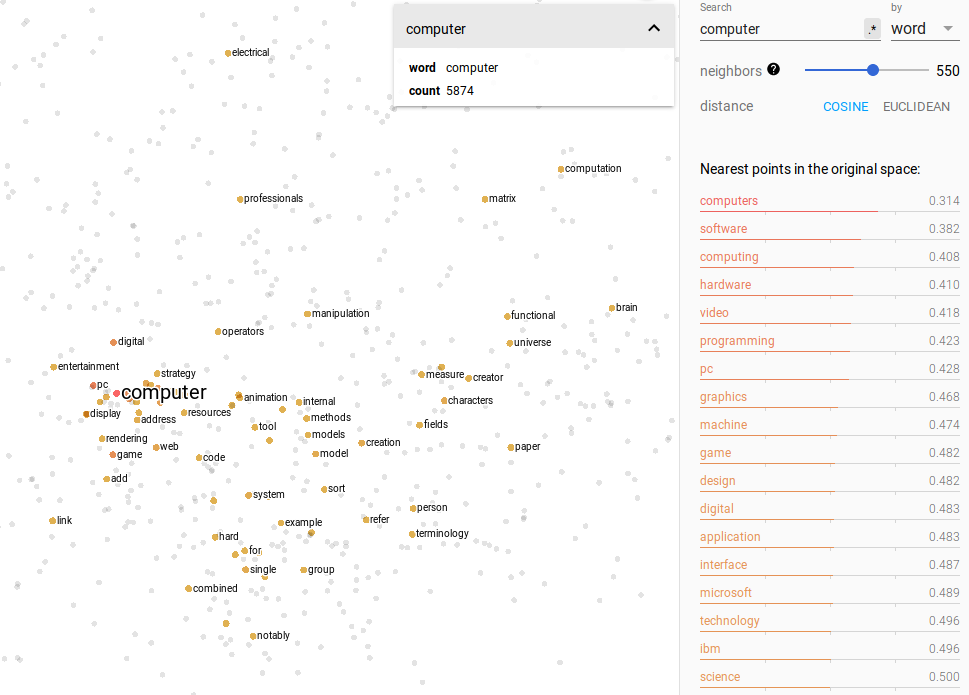

# Finding Plagiarisms with Word2Vec 

## What is Word2Vec
Word2Vec utilizes vector representations of words, "word embeddings".
Word embedding is a popular framework to represent each word as a vector in
a vector space of many (for example 300) dimensions, based on the semantic
context in which the word is found.[2] This technique has been used in many
machine learning and natural language processing tasks.[4] The term word em-
bedding is being used to describe multiple word vectors in a data set as well as
for a single word vector in such a word embedding.
Imagining such high-dimensional vectors and word embeddings is challeng-
ing. Therefore, a tool - the Embedding Projector[7] - has been developed for
interactive visualization of high-dimensional data by rendering them in two or
three dimensions. The example in Figure 1 is based on input data from Word2Vec
All, which means this word embedding consists of roughly 70.000 vectors with
200 dimensions. Word2Vec[15] is a publicly available trained model and one from
the collection of models in the Embedding Projector by Google. To reduce the
dimensionality of this data set, the t-SNE (T-distributed stochastic neighbor
embedding), a nonlinear nondeterministic algorithm has been chosen because it 
tries to preserve local neighborhoods in the data, meaning that vectors of words
with similar semantics are being projected in close approximation.[8]

*Figure 1 the Embedding Projector*

## Algorithm Idea
As we can see in Figure 1, words which convey the same meaning / are about the same
subject are clustered together. Words concerning other topics will be further away. 
We can compute how close words represented by a word embedding are to each other, 
by calculating the cosine similarity (direction) of these vectors. 
A cosine similarity of 1 means it is the same word.
A cosine similarity going towards 0 means the words are completely different.

If we do this word by word, we would know how much the separate words are alike.
Yet, plagiarisms are more about sentences and paragraphs rather than words.
Therefore, we should rather calculate the mean vectors of sentences and compare these.
During explorative testing I noticed that a cosine similarity > 0.9 is rather reliable 
indication that sentences are very much alike. Like a plagiarised sentence would be. 
Maybe slightly altered, but in essence the same. 
Therefore, that would be my suggestion to start with if looking for possible plagiarisms.

##Implementation
There is no need to implement Word2Vec and the necessary functions from scratch, since 
there are some pretty cool libraries in multiple languages.

As I first had this Idea, I build an explorative implementation in Python using spaCy.
I found that the idea worked and that the quality of the Word2Vec models used made quite 
a difference in outcome for, for example, th similarity function. 
I recommend to find the biggest, most diverse model possible an to test with different 
models to see what works best.
(LINK TO A PUBLIC GITHUB)

For Java/Scala, there is a library deeplearning4j (dl4j) and nd4j 
(dl4j is based on nd4j and there are some functions you might need from here).

I recommend to build this in a separate project (micro service), 
since the dependencies of dl4j and nd4j are not compatible with the current project. 

##Speeding up the process with TF-IDF

A algorithm for finding wikipedia plagiarisms.
[Hyperparameters used by the algorithm.](https://github.com/WikiplagWS17/wikiplag-multi/blob/feature/plagiarism-finder-documentation/plagiarismFinder/src/main/scala/de/htwberlin/f4/wikiplag/plagiarism/models/HyperParameters.scala) 

##Literature
  1. Split into sentences (by splitting on punctuation marks).
  2. Combine short ones. (Minimum length specified by the <code>minimumSentenceLength</code> hyperparmater)
  3. Remove stop words.
  4. Build n-grams.
  5. Compute hashes for each n-gram.
